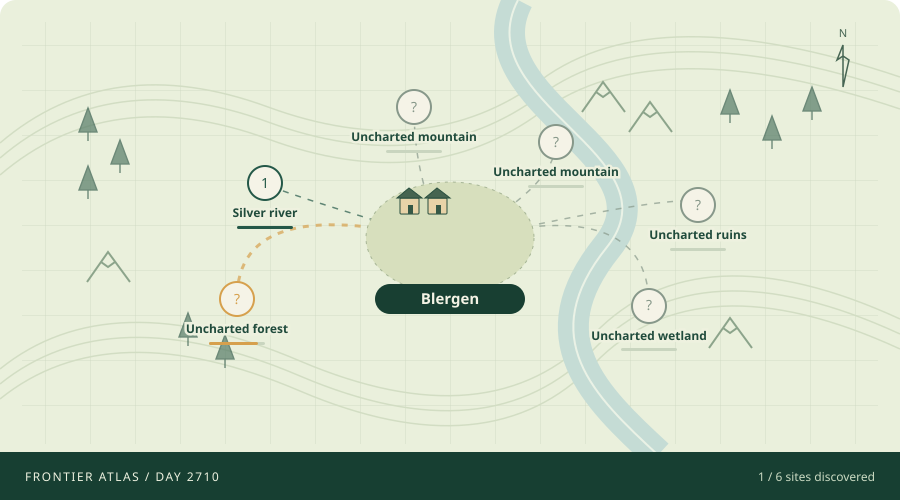

# Blergen: the frontier observatory



A persistent colony that advances once per UTC day. Ordinary households feed the village while named crews rebuild, chart the valley, and bring home discoveries. The default director runs entirely in Python: **zero paid API calls, no key, and no runtime dependencies**.

Open [docs/index.html](docs/index.html) locally for the illustrated atlas, exact saved resource trends, construction, expeditions, and personal stories. The SVG above refreshes with every daily commit. Each Actions run also provides a downloadable `blergen-atlas` artifact containing the offline dashboard.

## New chapter

Six permanent projects grow from kitchen gardens to an observatory. Named expedition crews discover six mapped locations, then continue returning with seasonal observations and knowledge. Household food production, maintenance, and sensible local leadership make long-term settlement possible while weather, shortages, illness, and conflict still matter.

Old saves migrate without deleting people or history. An already abandoned legacy colony receives twelve new settlers to start rebuilding; the dead remain dead and remembered. A later extinction waits thirty simulated days for another relief expedition. This is recorded immigration, never a reset.

## Run and visualize

Python 3.11 or later is enough for the free daily mode:

```powershell
python -m src.run_day
python -m src.run_day --render-only
```

The first command advances only if the colony has not run on today's UTC date. Repeated or manually retried runs do not choose events, incur API cost, or duplicate history. The second only rebuilds the graphics. `--data-dir` and `--output-dir` allow isolated experiments; `--date YYYY-MM-DD` supplies an explicit date for a replay and rejects dates before the saved last run. Missed real dates do not trigger a costly catch-up loop.

A process lock prevents overlapping local runs. State, chronicle, personal stories, and graphics are written through a local recovery journal; a retry replays an interrupted save before deciding whether another day is due.

## Optional OpenAI visits

Set `COLONY_AI_MODE=weekly` to invite OpenAI every seventh simulation day, or `daily` to use it each day. `off` is the default even if a key already exists. Each eligible day makes at most two requests (world event and president), with no retries, a 20-second timeout each, bounded recent context, and at most 384 output tokens per request including reasoning. Missing keys, missing SDK, and failed calls all use local decisions; an API outage no longer harms colonists.

```powershell
python -m pip install '.[ai]'
```

Then set these in `.env.local` (never commit keys):

```text
COLONY_AI_MODE=weekly
OPENAI_API_KEY=your_api_key_here
OPENAI_MODEL=gpt-5.4-mini
```

The existing model remains configurable; default free mode never contacts it. Output limits include reasoning tokens, as documented in [OpenAI's reasoning guide](https://developers.openai.com/api/docs/guides/reasoning).

## Why this is an agentic loop

The project has a simple observe-decide-respond-act-record loop:

1. Observe the current colony state from `src/state.json`.
2. Choose a seasonal world event using the local director or an optional AI visit.
3. Choose practical leadership for survival, construction, and exploration.
4. Derive the day's calendar date, season, and weather.
5. Apply household production, weather, event, leadership, construction, exploration, and survival effects.
6. Consume daily food, with each living colonist needing 1 food per day.
7. Record the result in `event_log` and `src/history.md`.
8. Persist the new state for the next run.

Because the next run depends on the saved result of the previous run, the loop is stateful.

## Individual colonists

Older state files can store `population` as only a number. When a day runs now,
the simulation upgrades that state with a `people` list containing one living
colonist per population member. Each colonist has a stable ID, distinct name,
role, personality, status, relationship placeholders, and personal story notes.

The current aggregate mechanics still drive the simulation. When those mechanics
reduce population, the loss is assigned to named colonists, those colonists are
marked dead, and the day's event record includes their death records. The daily
history entry also names colonists who died.

Daily world events and leadership actions also touch individual colonists. For
example, illness can name who fell sick, disputes can create rivalries, discovery
credits a scout or forager, and work orders name the colonists who took part.
These personal consequences are saved in each colonist's story notes and in the
day's `people_events` record.

The colony president is also a specific living colonist. The saved state tracks
their `id`, `name`, and first day in office. If no living president exists, the
simulation deterministically selects one from the living colonists before asking
for a leadership action. If the colony has no living people, the office is
removed until new settlers arrive.

`population`, `health`, and `morale` are derived from the living colonists.
Population is the count of living people, while health and morale are integer
averages of living colonists' personal status values. Food, wood, security, and
known threats remain colony-level fields.

## Seasons, weather, and threats

Day 1 is January 1 of year 1 in the colony calendar. The saved state tracks the
current year, and dates are derived from the saved day number, so day 50 is
February 19 of year 1 and day 366 is January 1 of year 2. The simulation uses
four seasons:

- Winter: December, January, February
- Spring: March, April, May
- Summer: June, July, August
- Autumn: September, October, November

Every day has deterministic weather based on the day and season. Weather is
recorded in the event log and can have small mechanical effects, such as snow
costing wood, hard freezes hurting health, or severe winter weather lowering
morale.

`known_threats` now affects what events are available to the selector. `wolves`
can become a rare but dangerous `wolf_attack`, `winter` raises the importance
of winter weather and storm danger, and discovered undead trouble is tracked as
`undead`. Winter itself is not an event; it is a season that shapes the weather
table and the prompt context.

The OpenAI selectors receive a bounded `character_context` section with role
counts, status summaries, and a small set of relevant named colonists. The deity
prompt sees current vulnerabilities and recent stories. The president prompt
gets colonists relevant to the chosen world event, such as sick colonists during
illness, rivals during disputes, or scouts during discoveries. OpenAI still only
chooses from the allowed event and action labels.

The readable archive is split in two:

- `src/history.md` records the colony-level chronicle.
- `src/people_history.md` records individual colonist moments as bullet points
  with personal status changes. The durable machine-readable version of each
  colonist's story remains in `src/state.json`.

## Run one day

From the project root:

```powershell
python -m src.run_day
```

On a new UTC date this updates `src/state.json`, `src/history.md`, `src/people_history.md`, and the atlas in `docs/`.

## OpenAI selectors

Create `.env.local` in the project root:

```text
OPENAI_API_KEY=your_api_key_here
OPENAI_MODEL=gpt-5.4-mini
```

Optional AI requires `COLONY_AI_MODE=weekly` or `daily`. A missing key uses the free local director.

The OpenAI selectors only choose from allowed labels. The mechanical effects still come from deterministic local code.

The deity selector is prompted as a deity deciding what event, if any, should befall Blergen. It can choose:

```text
good_harvest, poor_harvest, illness, dispute, discovery,
foraging, storm, wolf_attack, undead_rising, quiet_day
```

The prompt asks the deity to favor impactful events and choose `quiet_day` only
about 15 to 25 percent of the time. `foraging`, `storm`, `wolf_attack`, and
`undead_rising` include a severity from 1 to 5. Foraging severity represents
success, with sharply lower yields in winter. Wolf attacks are cooled down after a recent pack
attack unless the new attack is severity 5. When they do happen, severity 2 and
higher can injure defenders, severity 3 can kill if security is weak, and
severity 4 and 5 attacks kill colonists outright. Stronger storms can damage
stores, wood, health, morale, and in extreme sickly conditions, population.
`undead_rising` is intended to be rare: one named dead colonist can rise, active
zombies can attack the living, and uncontained infections create more zombies.

The president selector is prompted as the president of Blergen deciding how to respond to the event. It can choose:

```text
preserve_resources, ration_food, gather_wood, gather_clay,
make_pottery, fire_bricks, build_with_brick, expand_fields,
harvest_crops, strengthen_defenses, tend_the_sick, mediate_dispute,
send_scouts, hold_festival, fight_undead, contain_undead
```

If the deity API call fails, the local seasonal director supplies the world event without an outage penalty. Old `chaos_gods` records remain in the archive.

If the president API call fails, the local president chooses a useful action based on the colony's needs.

If the president chooses `strengthen_defenses` when the colony has fewer than 10 wood, the simulation records `failed_strengthen_defenses` instead and leaves wood, security, and morale unchanged.

If the president chooses `strengthen_defenses` during a wolf attack and the
colony has enough wood, the attack's effective severity is reduced by one level.

If the dead rise, `fight_undead` can destroy active zombies while risking
security and morale. `contain_undead` costs wood and can isolate zombies before
the infection spreads. If the colony does not kill or contain active zombies,
living colonists can die and become new active undead. The persistent
`undead_threat` state tracks active and contained zombies.

Food is consumed every day regardless of events or leadership actions. Each
living colonist normally needs 1 food per day. `ration_food` lowers daily food
need by roughly a quarter, but costs morale and makes a few colonists feel the
strain. If there is not enough food, named
colonists miss rations and their hunger rises. Severe hunger causes named
starvation deaths, reducing population.

Households now produce daily subsistence food, improved by kitchen gardens and the river dock. Additional field production is seasonal and must be planned ahead. `expand_fields` does not
produce edible food. It prepares `agriculture.crop_fields`, representing crops
in the ground that can feed the colony later. Field work is strongest in spring,
still useful in summer, limited in autumn, and ineffective in winter.

Prepared crop fields become stored food only during summer and autumn harvests.
The `harvest_crops` action converts ready crop fields into food in those seasons.
`good_harvest` and `poor_harvest` are seasonal harvest events: they only create
food from existing crop fields, with good harvests yielding more and poor
harvests yielding less or damaging crops. This means Blergen has to spend spring
and summer building future food, then save the abundant summer and autumn stores
for winter and spring.

`foraging` remains an emergency food source that produces variable food from
about a quarter-day to two days of current population needs, with sharply lower
winter yields. Food-costing actions such as `hold_festival` and `tend_the_sick`
also scale with population.

Discoveries can now become durable colony resources instead of one-day flavor.
The saved `resources` state tracks known deposits, gathered stockpiles, and
permanent improvements. Older saves without a `resources` section are migrated
from prior discovery entries in the event log, so clay already found in the
history can become usable after the next run.

The first worked resource is clay. `discovery` can reveal or improve a known
clay deposit. `gather_clay` converts deposit abundance into stored clay.
`make_pottery` turns clay into storage pottery that reduces food losses during
storms. `fire_bricks` turns clay and wood into bricks. `build_with_brick` turns
bricks into permanent shelter work, improving security and reducing some storm
wood and health damage. Discovery records can also preserve other useful sites,
such as fresh water and trail markers, for future mechanics.

When a frontier colony loses its last colonist, days remain empty without selector calls until the thirty-day relief window. A modest rebuilding expedition then arrives, preserving the entire earlier story.

## Blergen Company interventions

Blergen Company can intervene before the normal daily event and leadership
choices by passing flags to the same command that advances the colony. The
intervention is recorded in the day's event log.

Send 100 new settlers:

```powershell
python -m src.run_day --send-settlers
```

Send a custom number of settlers:

```powershell
python -m src.run_day --send-settlers 25
```

Send food:

```powershell
python -m src.run_day --send-food 200
```

Send supplies. With no values, this defaults to 50 wood and 2 security:

```powershell
python -m src.run_day --send-supplies
```

Send custom supplies:

```powershell
python -m src.run_day --send-supplies 80 3
```

Multiple interventions can be combined and are applied in order:

```powershell
python -m src.run_day --send-settlers --send-food 300 --send-supplies
```

The lower-level top-level `company_interventions` queue in `src/state.json` is
still supported for scripts, but CLI flags are the intended manual interface.

## Run tests

Install dependencies if needed:

```powershell
python -m pip install '.[test]'
```

Then run:

```powershell
python -m pytest
```

## GitHub Actions

The daily workflow runs at **12:17 UTC** (08:17 New York in daylight time, 07:17 in standard time), with manual dispatch and a verification run when its workflow file changes. UTC-date idempotency prevents duplicate advances. The default job has no dependency installation or AI calls; optional SDK installation failure also falls back locally. Tests run separately on code changes, with a five-minute timeout. Daily state and graphics are committed together, and concurrent Git changes are rebased without force-pushing.

No repository secrets are needed for free mode. Optional repository variables are `COLONY_AI_MODE` (`off`, `weekly`, `daily`) and `OPENAI_MODEL`; the optional secret is `OPENAI_API_KEY`.

GitHub scheduled jobs can be delayed. Public schedules may disable after sixty days without repository activity; successful daily state commits keep the repository active. See [GitHub's schedule documentation](https://docs.github.com/en/actions/reference/workflows-and-actions/events-that-trigger-workflows#schedule). If a run fails, its Actions log and rerun button are the recovery path. No always-on server or recurring Codex task is required.

## Validation

Tests cover legacy mechanics, migration, practical decisions, weather diversity, a full simulated year, recovery from an abandoned world, exact data rendering, duplicate dates, process locks, and interrupted file writes. Historical chart values begin when exact snapshots were introduced; older absolute values are not invented from incomplete event deltas.

## Daily email reports

Each scheduled run can send one email after the new world has been successfully pushed to GitHub. The email contains a plain-text and HTML account of the completed day, resources, development and personal/civic highlights. Attachments include `index.html` (the full visual dashboard), `colony.svg` (the map) and `colony-atlas.zip` (all files needed for relative links, including any full chronicle). Save and open the HTML, or extract the ZIP and open its `index.html`. No model call or extra Python dependency is used for email.

Email delivery is off until a sending account is connected. Configure these **GitHub Actions secrets**:

| Secret | Value |
| --- | --- |
| `COLONY_EMAIL_TO` | One recipient mailbox |
| `SMTP_HOST` | Your provider's SMTP hostname |
| `SMTP_FROM` | Authorized sender mailbox, optionally with a display name |
| `SMTP_USERNAME` | SMTP login |
| `SMTP_PASSWORD` | SMTP/provider app password |
| `SMTP_SECURITY` | `ssl` (default) or `starttls` |
| `SMTP_PORT` | `465` for SSL or `587` for STARTTLS by default |

Then set the **repository variable** `COLONY_EMAIL_ENABLED` to `true`. An optional `COLONY_DASHBOARD_URL` variable may point to an existing HTTPS dashboard; leave it unset to use the attached visual reports and Actions link. The local `.env.local` supports the same names. Keep all addresses and credentials in private configuration, never in public source or preview files.

For a private, one-time setup of **both** colonies, sign in with `gh auth login --hostname github.com`, then run the helper from either project:

```sh
python scripts/configure_email.py --to you@example.com --sender you@example.com --host smtp.example.com
```

It reads the SMTP password with hidden terminal input, uploads secrets via standard input to the explicitly authenticated GitHub CLI, enables both schedules' email steps, and dispatches each latest report without advancing either world. It never extracts Git credentials or saves the password locally. For Gmail, use `--host smtp.gmail.com` and a Gmail app password; [Google requires 2-Step Verification for app passwords](https://support.google.com/accounts/answer/185833?hl=en). Use the sender account authorized by your SMTP provider.

To retry email only, manually run **Advance Colony** and check **Send the latest saved report without advancing the colony**, or use:

```sh
gh workflow run advance-colony.yml -f email_only=true
```

The receipt in `src/email_delivery.json` prevents normal repeated delivery to the same recipient for the same saved day. It contains hashes and timestamps, not email addresses or credentials. A failed send leaves the colony safely committed and records no success receipt. SMTP acceptance followed by a crash or a failed receipt push can still cause a duplicate on retry; inspect the inbox if the workflow reports that receipt failure. SMTP acceptance is not proof of inbox delivery, so check spam during initial setup. Disabling `COLONY_EMAIL_ENABLED` stops email without stopping the simulation.

Preview the full MIME email locally without sending or changing any state:

```sh
python -m src.email_delivery --preview .email-previews/latest.eml
```

Previews are ignored by Git. No live email was sent merely by generating a preview.
